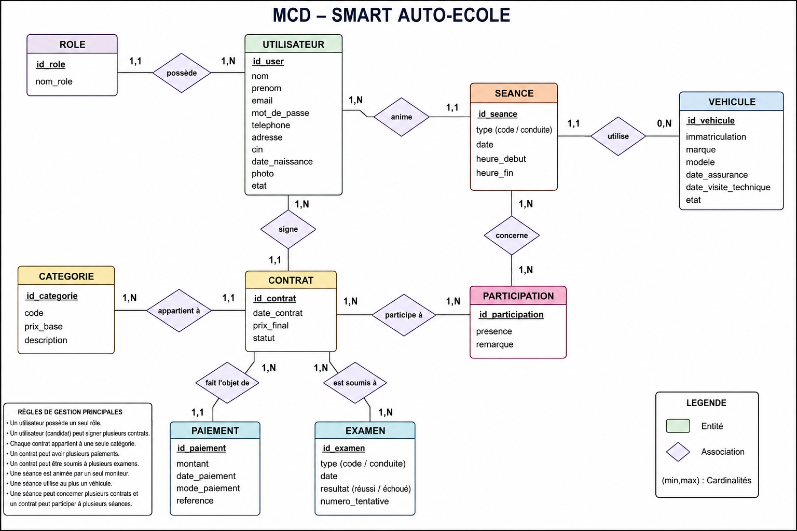

# Modèle Conceptuel de Données (MCD)

# Smart Auto-Ecole

---

## Objectif

Le Modèle Conceptuel de Données (MCD) décrit les entités, les associations et les cardinalités du système **Smart Auto-Ecole**.

Il représente les besoins métiers sans prendre en compte les aspects techniques de la base de données (clés étrangères, types SQL, contraintes, etc.).

---

# Diagramme MCD

Le diagramme suivant représente la version finale du MCD.

  

---

# Entités

## Role

Représente les différents rôles disponibles dans l'application.

**Attributs :**

- id_role
- nom_role

---

## Utilisateur

Représente toute personne utilisant l'application.

Selon son rôle, un utilisateur peut être :

- Directeur
- Secrétaire
- Moniteur
- Candidat

**Attributs :**

- id_user
- nom
- prenom
- email
- mot_de_passe
- telephone
- adresse
- cin
- date_naissance
- photo
- etat

---

## Catégorie

Représente une catégorie de permis de conduire.

**Attributs :**

- id_categorie
- code
- prix_base
- description

---

## Contrat

Représente l'inscription d'un candidat à une catégorie de permis.

Un candidat peut signer plusieurs contrats au cours de sa vie dans l'auto-école.

**Attributs :**

- id_contrat
- date_contrat
- prix_final
- statut

---

## Paiement

Représente un paiement effectué dans le cadre d'un contrat.

Un contrat peut être payé en plusieurs fois.

**Attributs :**

- id_paiement
- montant
- date_paiement
- mode_paiement
- reference

---

## Véhicule

Représente un véhicule utilisé pour les séances pratiques.

**Attributs :**

- id_vehicule
- immatriculation
- marque
- modele
- date_assurance
- date_visite_technique
- etat

---

## Séance

Représente une séance de formation.

Une séance peut être :

- Théorique (Code)
- Pratique (Conduite)

Chaque séance est animée par un seul moniteur.

**Attributs :**

- id_seance
- type
- date
- heure_debut
- heure_fin

---

## Participation

Représente la participation d'un candidat à une séance.

Cette association permet de gérer les relations plusieurs-à-plusieurs entre les contrats et les séances.

**Attributs :**

- id_participation
- presence
- remarque

---

## Examen

Représente un examen passé par un candidat.

Un contrat peut comporter plusieurs examens (en cas d'échec ou de repassage).

**Attributs :**

- id_examen
- type
- date
- resultat
- numero_tentative

---

# Associations

| Association | Cardinalité |
|-------------|-------------|
| Role → Utilisateur | 1,N |
| Utilisateur → Contrat | 1,N |
| Utilisateur (Moniteur) → Séance | 1,N |
| Catégorie → Contrat | 1,N |
| Contrat → Paiement | 1,N |
| Contrat → Examen | 1,N |
| Véhicule → Séance | 0,N |
| Contrat ↔ Séance | N,N (via Participation) |

---

# Règles de gestion

- Un utilisateur possède un seul rôle.
- Un rôle peut être attribué à plusieurs utilisateurs.
- Un candidat peut signer plusieurs contrats.
- Chaque contrat concerne une seule catégorie de permis.
- Une catégorie peut être associée à plusieurs contrats.
- Un contrat peut recevoir plusieurs paiements.
- Chaque paiement appartient à un seul contrat.
- Un contrat peut comporter plusieurs examens.
- Chaque examen appartient à un seul contrat.
- Une séance est animée par un seul moniteur.
- Un moniteur peut animer plusieurs séances.
- Une séance pratique utilise un seul véhicule.
- Un véhicule peut être utilisé dans plusieurs séances.
- Une séance peut accueillir plusieurs candidats.
- Un candidat peut participer à plusieurs séances.
- La participation permet d'enregistrer la présence et les remarques de chaque candidat lors d'une séance.

---

## Version

**Version : 1.0**

**Statut : Validé**
