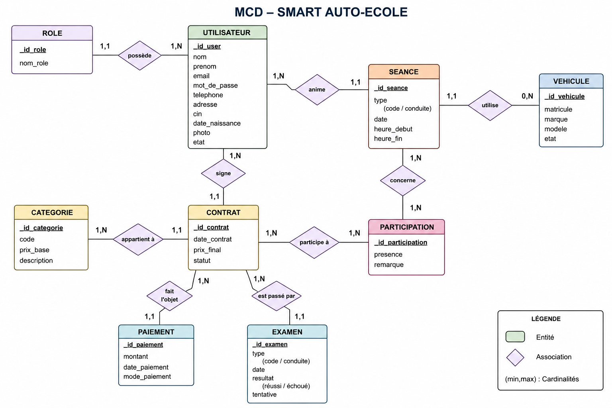

# Modèle Conceptuel de Données (MCD)

## Objectif

Le Modèle Conceptuel de Données (MCD) représente les entités, les associations et les cardinalités du système Smart Auto-Ecole.

---

## Diagramme MCD

> Version 1.0

  

---

## Entités

- Role
- Utilisateur
- Catégorie
- Contrat
- Paiement
- Véhicule
- Séance
- Participation
- Examen

---

## Règles de gestion

- Un utilisateur possède un seul rôle.
- Un candidat peut signer plusieurs contrats.
- Un contrat est associé à une seule catégorie.
- Un contrat peut recevoir plusieurs paiements.
- Un paiement appartient à un seul contrat.
- Une séance est animée par un seul moniteur.
- Une séance de conduite utilise un véhicule.
- Une séance peut accueillir plusieurs candidats.
- Un candidat peut participer à plusieurs séances.
- Un contrat peut comporter plusieurs examens.

---

## Remarques

- Les moniteurs et les candidats sont représentés dans la table `utilisateurs` et différenciés par leur rôle.
- Les paiements sont liés aux contrats.
- Les participations permettent de gérer la relation plusieurs-à-plusieurs entre les contrats et les séances.
